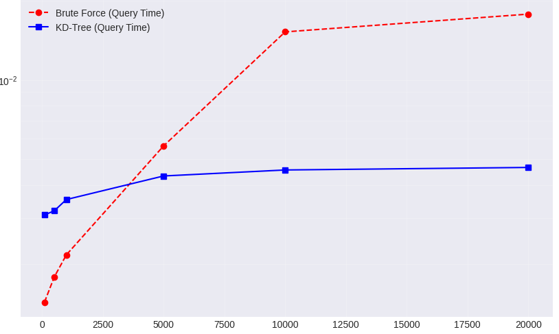

# ⚡ K-Nearest Neighbors Optimization: K-D Trees in C++ & Python

## 📖 Overview

This project presents a comprehensive analysis and optimization of the **K-Nearest Neighbors (KNN)** algorithm. To overcome the performance limitations of standard Brute Force search ($O(N)$), we implemented a **K-Dimensional Tree (K-D Tree)** data structure ($O(\log N)$).

The core of the project is a **hybrid architecture**:
1.  **Python:** Used for data manipulation, visualization, and high-level logic.
2.  **C++:** Used for the computationally intensive tree construction and recursive search, connected to Python via **pybind11**.

We benchmarked our custom implementations against **Scikit-learn** and a naive Brute Force approach using a dataset of **47,000+ world cities**.

---

## 📊 Key Results

Our optimized C++ implementation matches Scikit-learn's accuracy while offering massive performance gains over standard Python and Brute Force methods.

| Implementation | Build Time (s) | Query Time (s) | Accuracy | Speedup vs Brute Force |
| :--- | :--- | :--- | :--- | :--- |
| **Python K-D Tree** | 0.19s | 56.88s | 93.6% | ~1x |
| **Brute Force** | 0.00s | 122.51s | 91.6% | 1x (Baseline) |
| **C++ K-D Tree** | **0.01s** | **0.05s** | **93.6%** | **~170x** |
| **Scikit-learn** | 0.01s | 0.03s | 93.6% | ~440x |

*(Results based on N=10,000 samples with 5 features)*

### Scalability Analysis
As the dataset size increases, the C++ K-D Tree maintains logarithmic performance, while Brute Force degrades linearly.

*Fig 1: Log-scale comparison of execution time vs. dataset size.*

---

## ✨ Features

*   **Custom K-D Tree:** Full implementation of tree construction (using median splitting) and recursive Nearest Neighbor search with backtracking.
*   **C++ Acceleration:** Critical paths written in C++17, exposing a Python interface using `pybind11`.
*   **Geospatial Search:** Integration of the **Haversine formula** to calculate precise Great-circle distances for city search.
*   **Visualization:** 
    *   2D/3D Decision Boundaries.
    *   Voronoi tessellation of the search space.
    *   Interactive map visualizations of nearest cities.
*   **Theoretical Analysis:** Visualizations of the "Curse of Dimensionality" and K-value sensitivity.
